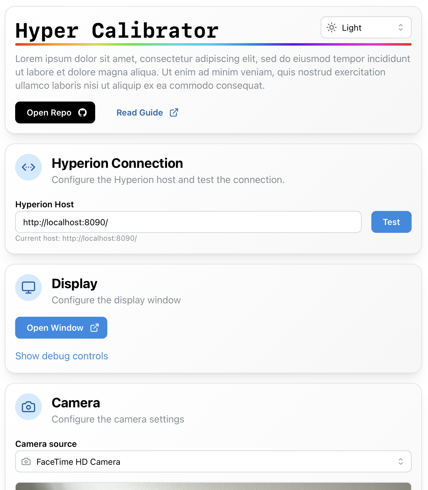

# Hyper Calibrator

> [!WARNING]
> This entire project / idea is still very much WIP, any feedback and ideas are welcome.

A small utility to help calibrate the color of ambient light setups made wither
[Hyperion.ng](https://github.com/hyperion-project/hyperion.ng), [HyperHDR](https://github.com/awawa-dev/HyperHDR) or similar ambient light utilities.

[Try it now!](https://janus-pedersen.github.io/hyper-calibrator/)

<!--  -->

## Demo

Below is a demo of the calibration process for a white color

## The idea

It works by overriding the emitted light and comparing it with the color displayed on the screen with the help of a webcam. By using an itterative algorithm, it then tries to minimize the difference between the two. Once an optimal solution has been found, it's stored as a color channel adjustment (currently only in a temporary way, see issue [#1](https://github.com/janus-pedersen/hyper-calibrator/issues/1)).

## Caveats

The current solution uses a webcam video stream as a color measurement method. This means that it's practically impossible to reach _aboslute_ color accuracy, but since the goal is to make it match the color of the display, it only needs to optimize for _relative_ color accuracy. It still isn't a perfect solution and there are many downsides to this, such as automatic whitebalance and difference in perceived vs captured color and so on.

## How to use it

Please read the [guide](./GUIDE.md)
